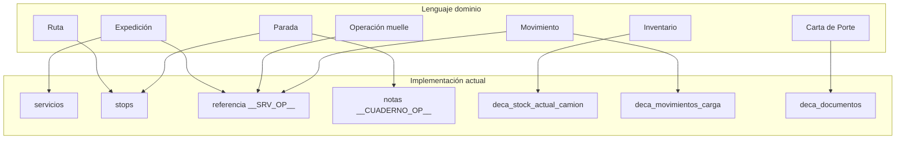

# Cuaderno de Ruta Enterprise — Fase 1: Evolución del Dominio

**Versión:** 1.0  
**Fecha:** 2026-06-28  
**Estado:** Hoja de ruta (sin implementación)  
**Prerequisito:** Documento DDD — *Modelo del Dominio Logístico*  
**Alcance:** Infraestructura de dominio · sin cambios visibles al usuario · sin Centro Logístico ALDI

---

## Resumen ejecutivo

Cuaderno de Ruta **ya materializa el 70–80 % del modelo DDD** en persistencia y lógica operativa, pero con vocabulario fragmentado (`servicio` vs expedición), **tres modelos documentales** (DCDT, DeCA autónomo, DeCA vivo), **doble flujo de paradas** (sesión muelle + stops legacy) y **acoplamiento extremo** en `src/cuaderno-ruta.jsx` (~18.290 líneas).

La Fase 1 **no añade funcionalidad ALDI ni cambia comportamiento**. Introduce:

1. Capa de dominio explícita (`src/domain/expedicion/`) como **fachada** sobre código existente.
2. Lenguaje ubicuo en tipos JSDoc y constantes.
3. Contratos de repositorio y casos de uso que **delegan** en APIs actuales.
4. Diseño de migraciones SQL **solo aditivas** (no ejecutar en Fase 1).
5. Plan incremental en subfases de 1–3 días, siempre desplegable.

**Principio rector:** Evolucionar, no sustituir. Un expediente, un inventario, un DeCA vivo por viaje.

---

## 1. Mapa de equivalencias: dominio ↔ implementación

### 1.1 Entidades del dominio

| Entidad DDD | Tabla(s) actual(es) | Módulo dominio / API | Componente(s) React | Hook(s) | API serverless | RPC Supabase |
|-------------|---------------------|----------------------|---------------------|---------|----------------|--------------|
| **Expedición** | `servicios` + meta `referencia` (`__SRV_OP__`) | `autonomoExpedienteApi.js`, `autonomoExpedienteMeta.js`, `expedienteCierre.js`, `serviceOperacionMeta.js` | `AutonomoExpedienteScreen.jsx` (~1.279 LOC), `ActiveServicePanel.jsx` (~2.557 LOC), `ExpedienteActivoResumenCard.jsx` | — | — | `create_autonomo_expediente_servicio` |
| **Ruta** | `stops` (orden) + `referencia.operational_plan` | `routePlanning.js`, `serviceStops.js`, `viajePlanSummary.js` | `EmpresaPlanificadorPanel.jsx`, `InternacionalParadasTab.jsx` | `useAutoOperationalEtaToFirstDescarga.js` | — | — |
| **Parada** | `stops` + meta `notas` (`__CUADERNO_OP__`) | `stopOperacionMeta.js`, `autonomoExpedienteStopModel.js` | `ConductorSimplifiedParadasTab.jsx`, `NacionalDestinoTab.jsx` | `useDriverFlatPendingStops.js` | — | `soltar_parada_conductor_guarded` |
| **Operación de muelle** | `referencia.operacion_muelle_activa` + stop sesión | `operacionMuelleModel.js`, `cargasPorMuelleModel.js` | `EnMuellePanel.jsx`, `EntradaMuelleModal.jsx`, `SalidaMuelleModal.jsx` | `useDriverActionLocation.js` | — | (vía movimientos DeCA) |
| **Inventario** | `deca_stock_actual_camion` | `decaVivoModel.js`, `inventarioExpedienteModel.js`, `decaVivoStock.js` | `ExpedienteOperacionalConductor.jsx`, `DecaVivoPanel.jsx` | — | `deca-vivo-inspect.js` | `obtener_deca_actual_visible` |
| **Línea de mercancía** | fila en `deca_stock_actual_camion` | `decaVivoStock.js`, `stopMercanciaMeta.js` | bloques stock en conductor | — | — | `deca_stock_line_key` |
| **Movimiento** | `deca_movimientos_carga` + `operacion.movimientos[]` (JSON) | `decaVivoModel.js`, `autonomoExpedienteApi.js` | `RegistroMovimientoModal.jsx`, `AutonomoRegistrarCargaModal.jsx` | — | — | `insertar_movimiento_carga`, `registrar_movimiento_carga`, `editar_movimiento_carga`, `anular_movimiento_carga` |
| **Carta de Porte (DeCA vivo)** | `deca_documentos`, `deca_versiones_historial` | `decaVivoModel.js`, `decaVivoPdf.js` | `DecaVivoPanel.jsx` | — | `deca-vivo-inspect.js` | `recalcular_deca_actual`, `generar_qr_deca_actual`, `obtener_deca_inspeccion_por_token` |
| **DCDT (flota)** | `dcdt_servicio`, `master_partes_transporte` | `dcdtModel.js`, `dcdtServicioSync.js`, `dcdtMultiDeCaUi.js` | `EmpresaDcdtModal`, `ConductorDcdtPanel` | `useConductorDcdtQuickStatus.js` | `dcdt-verify.js`, `dcdt-download.js` | `dcdt_cargador_groups_for_servicio` |
| **DeCA autónomo (legacy)** | `deca_autonomo` | `decaAutonomoModel.js`, `autonomoExpedienteDeca.js` | `AutonomoDecaPanel`, `AutonomoGenerarDecaModal.jsx` | — | `dcdt-download.js` | — |
| **Evidencia** | `evidencias` + Storage | `operationalDocumentPipeline.js`, `serviceDocuments.js` | `OperationalEvidenciasStop` | — | `cmr.js` (OCR) | `evidencias_validate_incidencia_adjunto` |
| **Incidencia** | `incidencias` **y** `timeline_events` | `incidenciasApi.js`, `registrarIncidenciaExpediente` | cards empresa, `OperationalEvidenciasStop` | — | — | `incidencias_validate_servicio_stop` |
| **Evento operativo** | `referencia.timeline_events[]` | `buildAutonomoExpedienteTimeline.js`, `appendExpedienteTimeline` | timeline en `AutonomoExpedienteScreen` | — | — | — |
| **Empresa** | `empresas`, `empresa_usuarios`, `conductor_empresa` | `empresaOfficeUsers.js`, `empresaFlotaLists.js` | `EmpresaLayout`, `EmpresaDashboardTower.jsx` | `useEmpresaOriginLookup.js` | `admin.js` | `lookup_empresa_por_codigo`, `get_current_office_user_context` |
| **Conductor** | `profiles`, `servicio_asignaciones` | `servicioAssignment.js`, `participacionTramosOperativos.js` | `ConductorSimplifiedParadasTab.jsx` | `useDriverActionLocation.js` | `push.mjs` | `finalizar_participacion_conductor_guarded` |
| **Vehículo** | `profiles.matricula`, `conductor_empresa.remolque` | `servicioVehiculoMatriculas.js`, `inventarioExpedienteModel.js` | `ServicioVehiculoMatriculaFields` | `useServicioVehiculoEdit.js` | — | `deca_resolve_matriculas_servicio` |
| **Lugar** | catálogos locales + `stops.nombre` | `autonomoAlmacenCatalog.js`, `autonomoDestinoCatalog.js` | modales almacén/destino | — | — | — |
| **Pedido externo (WMS)** | — | — | — | — | — | — (Fase ALDI) |

### 1.2 Patrones de meta JSON (contrato implícito actual)

**Expedición — `servicios.referencia`:**

```
[texto visible]
__SRV_OP__:{"autonomo_expediente_v1":true,"timeline_events":[],"operacion_muelle_activa":{...},...}
```

Parser canónico: `src/domain/service/serviceOperacionMeta.js`  
Espejo SQL: `servicio_operacion_meta_json(p_referencia)`

**Parada — `stops.notas`:**

```
[texto visible]

__CUADERNO_OP__:{"carga_estado":"completada","mercancia":{...},...}
```

Parser canónico: `src/domain/service/stopOperacionMeta.js`  
Espejo SQL: `stop_operacion_meta_json(p_notas)`

### 1.3 APIs cliente — orquestador principal

`src/modules/autonomo-expediente/autonomoExpedienteApi.js` (~1.292 LOC, 30 exports):

| Export | Rol dominio |
|--------|-------------|
| `createAutonomoExpediente` | Crear expedición |
| `loadAutonomoExpedienteWorkspace` | Cargar agregado lectura |
| `abrirOperacionMuelle` / `cerrarOperacionMuelle` / `anularOperacionMuelle` | Ciclo muelle |
| `registrarMovimientoEnMuelle` / `crearCargaEnMuelle` / `editarCargaEnMuelle` / `anularCargaEnMuelle` | Movimientos |
| `registerCargaOnExpediente` | Carga legacy (flota) |
| `addDestinoOnExpediente` / `updateDestinoEstado` | Paradas destino |
| `finalizarAutonomoExpediente` / `anularExpedienteAutonomo` | Cierre |
| `registrarIncidenciaExpediente` | Incidencia (solo timeline) |
| `appendExpedienteTimeline` | Eventos |

`src/domain/dcdt/decaVivoModel.js` (11 exports): inventario + DeCA vivo RPCs.

### 1.4 Diagrama de equivalencia



### 1.5 Triple modelo DeCA

```
┌─────────────────────────────────────────────────────────────┐
│ 1. DCDT SERVICIO (empresa / flota)                          │
│    dcdt_servicio + master_partes_transporte                 │
│    dcdtModel.js · stop link: dcdt_servicio_id en notas      │
└─────────────────────────────────────────────────────────────┘
                              │
┌─────────────────────────────────────────────────────────────┐
│ 2. DECA VIVO (inventario en viaje)                          │
│    deca_documentos · deca_movimientos_carga · deca_stock_*  │
│    decaVivoModel.js · RPCs movimiento/recálculo/QR          │
└─────────────────────────────────────────────────────────────┘
┌─────────────────────────────────────────────────────────────┐
│ 3. DECA AUTÓNOMO (documento standalone legacy)              │
│    deca_autonomo · decaAutonomoModel.js                     │
│    Bridge: referencia.deca_autonomo_links                   │
└─────────────────────────────────────────────────────────────┘
```

### 1.6 Elementos: existen vs. deben evolucionar

| Estado | Elementos |
|--------|-----------|
| **Existe y reutilizar** | `servicios`, `stops`, `deca_*`, sesión muelle, RPCs DeCA vivo, modales muelle, `AutonomoExpedienteScreen`, RLS `user_can_access_servicio` |
| **Existe con deuda técnica** | JSON en `referencia`/`notas`, triple DeCA, doble flujo paradas, `cuaderno-ruta.jsx` monolito, incidencias dual-path |
| **No existe (Fase 2+)** | Pedido WMS, retorno preparado, maestro tiendas, ACL integración ALDI |
| **Deprecar gradualmente** | `deca_autonomo` en flujo nacional muelle; `registerCargaOnExpediente` para flota ALDI futura |

---

## 2. Plan de evolución por entidad

| Entidad | Estado actual | Código existente | Reutilizar | Ampliar | Refactorizar | Riesgo |
|---------|---------------|------------------|------------|---------|--------------|--------|
| **Expedición** | Maduro autónomo; fragmentado flota | `autonomoExpedienteApi`, `servicios` | API completa, meta, cierre | Meta `domain_schema_version`, refs ALDI | Fachada `ExpedicionRepository` | Medio |
| **Ruta** | Stops ordenados; plan en JSON | `serviceStops`, `routePlanning` | Inserción/reemplazo stops | Vista lectura unificada | Extraer `Ruta` del workspace loader | Bajo |
| **Parada** | Dos semánticas (legacy + sesión) | `autonomoExpedienteStopModel` | Estados carga/destino | Meta tienda/pedido en `notas` | Value object `Parada` | Medio |
| **Operación muelle** | Solo JSON `operacion_muelle_activa` | `operacionMuelleModel`, `abrirOperacionMuelle` | Modelo completo | — | Tabla propia **Fase 3+** | Bajo en F1 |
| **Inventario** | Maduro (DeCA vivo) | `decaVivoStock`, `inventarioExpedienteModel` | Todo el stack | Categorías ALDI en meta línea | — | Bajo |
| **Movimiento** | Maduro append-only | `decaVivoModel`, RPCs | FASE A/B sin bloqueo | Tipo movimiento en constantes dominio | Command `RegistrarMovimiento` | Bajo |
| **Carta de Porte** | DeCA vivo operativo | `decaVivoModel`, `DecaVivoPanel` | QR, PDF, recálculo | — | Unificar vocabulario con DCDT | Medio |
| **DCDT** | Flota separado | `dcdtModel.js` | Flota empresa | Puente lectura DeCA vivo | — | Bajo |
| **DeCA legacy** | Coexiste | `decaAutonomoModel` | Histórico | — | Marcar `@deprecated` en dominio | Bajo |
| **Evidencia** | Maduro | `operationalDocumentPipeline` | Pipeline upload | — | — | Bajo |
| **Incidencia** | Dual: tabla + timeline | `incidenciasApi` + `registrarIncidenciaExpediente` | Ambos paths | Comando unificado | `RegistrarIncidencia` | Medio |
| **Timeline** | Meta + derivado | `buildAutonomoExpedienteTimeline` | Builder actual | Tipos evento dominio | Normalizar eventos **Fase 2+** | Bajo |
| **Empresa** | Maduro tenant | `empresas`, `EmpresaLayout` | RLS, oficina | Rol centro logístico = tráfico | — | Bajo |
| **Conductor** | Maduro | `profiles`, assignment | Asignación multi-conductor | — | — | Bajo |
| **Pedido** | Ausente | — | — | Referencia en meta | ACL stub | Nulo en F1 |

---

## 3. Diseño de migraciones SQL

**Regla Fase 1:** solo migraciones **aditivas, idempotentes y reversibles**. Sin `DROP` de columnas, sin `NOT NULL` en columnas existentes, sin cambio de firmas RPC.

### M0 — Convención meta (sin DDL)

| Campo | Valor |
|-------|-------|
| **Objetivo** | Introducir `domain_schema_version: 1` en `__SRV_OP__` vía código |
| **Tablas** | Ninguna |
| **Compatibilidad** | Total (clave opcional) |
| **Orden** | 0 |
| **Rollback** | Eliminar clave meta |

### M1 — Índices rendimiento DeCA

| Campo | Valor |
|-------|-------|
| **Objetivo** | Acelerar consultas inventario/movimientos por expedición |
| **Tablas** | `deca_movimientos_carga (servicio_id, fecha_hora DESC)`, `deca_stock_actual_camion (servicio_id)` |
| **Compatibilidad** | Total (`CREATE INDEX CONCURRENTLY` en prod) |
| **Orden** | 1 |
| **Rollback** | `DROP INDEX IF EXISTS` |

### M2 — Comentarios y vista lectura

| Campo | Valor |
|-------|-------|
| **Objetivo** | `COMMENT ON` tablas DeCA; vista `v_expedicion_inventario_resumen` (JOIN servicio + stock + deca) |
| **Tablas** | `deca_*`, `servicios` (vista) |
| **Compatibilidad** | Total; app no depende de vista hasta Fase 2 |
| **Orden** | 2 |
| **Rollback** | `DROP VIEW` |

### M3 — Columnas opcionales futuras (Fase 2, diseño)

| Campo | Valor |
|-------|-------|
| **Objetivo** | `stops.referencia_externa TEXT NULL`, `servicios.codigo_ruta TEXT NULL` |
| **Compatibilidad** | Aditivo |
| **Orden** | Fase 2 |
| **Rollback** | `DROP COLUMN` (sin datos obligatorios) |

### M4 — Tabla `operaciones_muelle` (Fase 3+, NO Fase 1)

| Campo | Valor |
|-------|-------|
| **Objetivo** | Persistir sesión muelle fuera de JSON |
| **Riesgo** | Alto; requiere dual-write |
| **Decisión Fase 1** | Posponer; seguir en meta |

### M5 — Tabla `pedidos_externos` / WMS (Fase ALDI, NO Fase 1)

| Campo | Valor |
|-------|-------|
| **Objetivo** | Referencia pedido tienda |
| **Decisión Fase 1** | Solo interfaz ACL en código |

### M6 — Consolidación RLS (Fase 2+, diseño)

| Campo | Valor |
|-------|-------|
| **Objetivo** | Una definición canónica de `user_can_access_servicio` (hoy redefinida en ~15 migraciones) |
| **Riesgo** | Alto en prod |
| **Decisión Fase 1** | Documentar; no tocar |

**Orden de ejecución (cuando se implemente SQL):** M1 → M2. M0 por código. M3–M6 fuera de Fase 1 ejecutable.

**Archivo propuesto (no crear hasta validación):**  
`supabase/migrations/20260801120000_expedicion_domain_indexes.sql`

---

## 4. Refactor del dominio — estructura propuesta

Reutiliza código existente mediante **fachadas y adaptadores**. En Fase 1 no se mueve lógica de negocio; se **envuelve y renombra**.

```
src/domain/expedicion/
├── README.md                          # Lenguaje ubicuo + mapa equivalencias
├── constants/
│   ├── EstadosExpedicion.js           # wrap EXPEDIENTE_ESTADO + SERVICIO_ESTADO
│   ├── TiposMovimiento.js             # re-export DECA_VIVO_MOVIMIENTO
│   └── DomainSchemaVersion.js         # DOMAIN_SCHEMA_VERSION = 1
├── types/
│   └── expedicion.types.js            # JSDoc: Expedición, Parada, Movimiento…
├── entities/                          # factories lectura (sin ORM)
│   ├── Expedicion.js
│   ├── Parada.js
│   └── Movimiento.js
├── aggregates/
│   └── ExpedicionAggregate.js         # workspace → objeto dominio
├── repositories/                      # delegan APIs existentes
│   ├── ExpedicionRepository.js        # → autonomoExpedienteApi
│   ├── ParadaRepository.js            # → serviceStops + patchStopOperacionMeta
│   ├── InventarioRepository.js        # → decaVivoModel
│   └── MuelleRepository.js            # → operacionMuelleModel
├── commands/                          # casos de uso (thin wrappers Fase 1)
│   ├── CrearExpedicion.js
│   ├── AbrirMuelle.js
│   ├── RegistrarMovimiento.js
│   ├── CerrarMuelle.js
│   ├── RegistrarParadaLlegada.js
│   └── CerrarExpedicion.js
├── queries/
│   ├── ObtenerInventarioActual.js
│   ├── ObtenerExpedicionWorkspace.js
│   └── ObtenerTimeline.js
├── services/                          # orquestación sin I/O directo (Fase 2+)
│   └── ExpeditionLifecycleService.js
├── events/
│   ├── DomainEventTypes.js
│   └── mapTimelineToDomainEvents.js
├── adapters/
│   ├── LegacyServicioAdapter.js       # servicio row → Expedición
│   ├── LegacyStopAdapter.js           # stop row → Parada
│   └── DecaVivoAdapter.js             # wrap decaVivoModel
└── anti-corruption/
    ├── WmsPedidoPort.js               # interface + noop impl
    └── ExternalLugarPort.js           # interface maestro tiendas (stub)
```

### Capas y responsabilidades

| Capa | Responsabilidad | Fase 1 |
|------|-----------------|--------|
| **Entidades** | JSDoc + factories desde rows legacy | `Legacy*Adapter` |
| **Agregados** | Consistencia lectura expedición | `ExpedicionAggregate.fromWorkspace()` |
| **Casos de uso** | Orquestación comandos | Delegación 1:1 a funciones existentes |
| **Repositorios** | Persistencia | Wrappers sobre `sbFetch` / APIs actuales |
| **Servicios dominio** | Reglas que cruzan agregados | Vacío o mínimo en F1 |
| **Adaptadores** | Traducción legacy ↔ dominio | Nuevos, sin BD |
| **Integraciones** | Puertos externos | Interfaces vacías |

### Código que NO se toca en Fase 1

- Lógica interna de `autonomoExpedienteApi.js`
- RPCs SQL y RLS
- Componentes React (salvo imports transparentes en Fase 2)
- `cuaderno-ruta.jsx`

---

## 5. Arquitectura React — evolución sin cambiar UI

### 5.1 Flujo de entrada actual

```
main.jsx → App.jsx → cuaderno-ruta.jsx (~18.290 LOC)
  └─ [gate autonomo_pro] → AutonomoExpedienteScreen.jsx
       └─ ExpedienteConductorShell.jsx
            └─ ExpedienteOperacionalConductor.jsx
```

Evento cross-component: `autonomo-expediente-open` (CustomEvent).

### 5.2 Componentes

| Categoría | Componentes | Acción Fase 1 |
|-----------|-------------|---------------|
| **Reutilizar tal cual** | `EnMuellePanel`, `EntradaMuelleModal`, `SalidaMuelleModal`, `RegistroMovimientoModal`, `DecaVivoPanel`, `OperationalEvidenciasStop`, `ConductorTabBar` | Sin cambios |
| **Reutilizar; inyectar commands en Fase 2** | `AutonomoExpedienteScreen`, `ExpedienteOperacionalConductor`, `ExpedienteConductorShell` | Solo cambiar imports internos |
| **Reutilizar flota** | `ActiveServicePanel`, `ConductorSimplifiedParadasTab`, `EmpresaFlotaServiciosList` | Sin cambios |
| **Dividir (Fase 3+)** | `cuaderno-ruta.jsx`, `ActiveServicePanel`, `AutonomoExpedienteScreen` | Documentar límites |
| **Demasiado grandes** | `cuaderno-ruta.jsx` (18.290), `ActiveServicePanel` (~2.557), `serviceExpediente.js` (~1.893) | Extracción gradual |

### 5.3 Hooks

| Hook | Ubicación | Acción |
|------|-----------|--------|
| `useDriverActionLocation` | `features/services/hooks/` | **Reutilizar** |
| `useConductorDcdtQuickStatus` | `features/services/hooks/` | **Reutilizar** |
| `useDriverFlatPendingStops` | `features/services/hooks/` | **Reutilizar** |
| `useServiceMessagesUnread` | `features/services/hooks/` | **Reutilizar** |
| `useAutoOperationalEtaToFirstDescarga` | `features/services/hooks/` | **Reutilizar** |
| `useEtaVisualClock` | `domain/service/` | **Reutilizar** |
| `useServicioVehiculoEdit` | `features/services/` | **Reutilizar** |
| `useEmpresaOriginLookup` | `src/hooks/` | **Reutilizar** |
| **Nuevo Fase 2** | `useExpedicionWorkspace(id)` | Encapsula `loadAutonomoExpedienteWorkspace` |
| **Nuevo Fase 2** | `useInventarioExpedicion(servicioId)` | Encapsula `obtenerInventarioActual` |
| **Desaparecer Fase 4+** | Lógica stock duplicada en componentes | Centralizar en hooks dominio |

### 5.4 Estado

| Tipo | Actual | Evolución Fase 1 |
|------|--------|------------------|
| **Global** | Sin Redux; `localStorage` + React state | Mantener |
| **Expedición workspace** | State en `AutonomoExpedienteScreen` | No mover |
| **Monolito** | `cuaderno-ruta.jsx` concentra fleet + tacógrafo | Extracción Fase 3+ |

**Fase 1: cero cambios visibles.**

---

## 6. APIs — clasificación y arquitectura objetivo

### 6.1 Serverless (`api/`)

| Endpoint | Clasificación | Rol dominio |
|----------|---------------|-------------|
| `deca-vivo-inspect.js` | **Reutilizable** | Inspección pública DeCA vivo |
| `dcdt-verify.js` | **Reutilizable** | Verificación QR DCDT |
| `dcdt-download.js` | **Reutilizable** | Descarga PDF DCDT + DeCA autónomo |
| `cmr.js` | **Ampliable** | OCR → evidencias |
| `push.mjs` | **Ampliable** | Notificaciones eventos expedición |
| `send-docs-email.js` | **Ampliable** | Cierre documental cliente |
| `admin.js` | **Reutilizable** | Gestión usuarios/empresa |
| `superadmin.js` | **Reutilizable** | Plataforma |
| `chat.js` | **Obsoleta** (dominio logístico) | Mantener por tacógrafo/demo |
| `stripe.js` | **Obsoleta** (UI deshabilitada) | Mantener por suscripciones |

### 6.2 Cliente → Supabase

| Grupo | Clasificación |
|-------|---------------|
| RPCs DeCA vivo | **Reutilizable** — núcleo dominio |
| `create_autonomo_expediente_servicio` | **Reutilizable** |
| CRUD `servicios` / `stops` / `evidencias` | **Reutilizable** |
| `registrarIncidenciaExpediente` | **Ampliable** → unificar con `incidencias` |
| `registerCargaOnExpediente` | **Ampliable** — `@deprecated` para flota ALDI |
| `servicio_operacion_meta_json` / `stop_operacion_meta_json` | **Reutilizable** — contrato meta |

### 6.3 Arquitectura API objetivo

```
UI / Commands (Fase 2+)
    ↓
domain/expedicion/commands/*
    ↓
repositories/*
    ├→ autonomoExpedienteApi.js (orquestador legacy)
    ├→ decaVivoModel.js (inventario + DeCA)
    └→ incidenciasApi.js (formal)
    ↓
sbFetch / RPC Supabase
```

**No crear REST nuevo en Fase 1.** Comandos = JavaScript puro en cliente.

---

## 7. Compatibilidad

### 7.1 Reglas

| Regla | Mecanismo |
|-------|-----------|
| **Strangler fig** | Nueva capa envuelve legacy; callers antiguos intactos |
| **Feature flags** | `productFeatures.js` — flags ALDI apagados |
| **Sin dual-write en F1** | Una fuente: meta + `deca_*` como hoy |
| **Tests regresión** | `decaVivoStock.test.js` + `npm run build` + smoke manual |
| **Migraciones** | Solo aditivas; app no depende de vistas nuevas |
| **RPCs** | No modificar firmas en F1 |
| **Rollback deploy** | Cada subfase revertible por commit |

### 7.2 Invariantes que no pueden romperse (INV-01–INV-15)

Durante toda la migración deben mantenerse:

- Un expediente activo por conductor autónomo (salvo multi-activos explícitos).
- Inventario único por servicio (`deca_stock_actual_camion`).
- Movimientos append-only; edición/anulación vía RPC guarded.
- DeCA vivo recalculado tras movimiento (FASE B no bloquea FASE A).
- Retorno = movimiento, no nueva expedición.
- Meta parse/merge sin pérdida de texto visible en `referencia`/`notas`.

### 7.3 Checklist pre-merge cada subfase

- [ ] `npm run build` OK
- [ ] Flujo autónomo: crear → muelle → carga → DeCA → destino → cierre
- [ ] Flujo flota: paradas + evidencias + DCDT
- [ ] `decaVivoStock.test.js` pasa
- [ ] Sin cambios visibles en UI

---

## 8. Plan de implementación por subfases

Cada subfase es **funcional y desplegable** antes de la siguiente.

### Fase 1.1 — Fundamentos de dominio (2–3 días)

| | |
|--|--|
| **Objetivo** | Crear `src/domain/expedicion/` con tipos, constantes, README, adapters lectura |
| **Archivos** | Nuevos en `domain/expedicion/**` |
| **Riesgo** | Bajo (solo adiciones) |
| **Dependencias** | Ninguna |
| **Entregable** | `LegacyServicioAdapter.toExpedicion()`, glosario en README |

### Fase 1.2 — Repositorios y comandos delegados (3–4 días)

| | |
|--|--|
| **Objetivo** | Repositories + commands thin-wrapper |
| **Archivos** | `repositories/*`, `commands/*`, tests unitarios adapters |
| **Riesgo** | Bajo |
| **Dependencias** | 1.1 |
| **Entregable** | `RegistrarMovimiento.js` → `registrarMovimientoEnMuelle` sin cambio comportamiento |

### Fase 1.3 — Catálogo eventos e incidencias (2 días)

| | |
|--|--|
| **Objetivo** | `DomainEventTypes.js`, `mapTimelineToDomainEvents.js`; documentar dual incidencia |
| **Archivos** | `events/*` |
| **Riesgo** | Bajo |
| **Dependencias** | 1.1 |
| **Entregable** | Catálogo alineado con DDD § eventos |

### Fase 1.4 — Puertos anti-corrupción (1–2 días)

| | |
|--|--|
| **Objetivo** | `WmsPedidoPort.js`, `ExternalLugarPort.js` (interfaces + Noop) |
| **Archivos** | `anti-corruption/*` |
| **Riesgo** | Nulo |
| **Dependencias** | 1.1 |
| **Entregable** | Contratos listos para Fase ALDI |

### Fase 1.5 — Migraciones SQL aditivas (1 día)

| | |
|--|--|
| **Objetivo** | M1 índices + M2 comentarios/vista |
| **Archivos** | `supabase/migrations/20260801120000_expedicion_domain_indexes.sql` |
| **Riesgo** | Bajo |
| **Dependencias** | Paralelo a 1.1–1.4 |
| **Entregable** | Migración aplicable en demo; rollback documentado |

### Fase 1.6 — Deprecaciones documentales (1 día)

| | |
|--|--|
| **Objetivo** | JSDoc `@deprecated`: `deca_autonomo` path nacional, `registerCargaOnExpediente` flota ALDI |
| **Archivos** | Comentarios en `decaAutonomoModel.js`, `autonomoExpedienteApi.js` |
| **Riesgo** | Nulo |
| **Dependencias** | 1.1 |
| **Entregable** | Guía de qué camino usar por contexto |

### Resumen temporal

| Subfase | Días | Riesgo |
|---------|------|--------|
| 1.1 | 2–3 | Bajo |
| 1.2 | 3–4 | Bajo |
| 1.3 | 2 | Bajo |
| 1.4 | 1–2 | Nulo |
| 1.5 | 1 | Bajo |
| 1.6 | 1 | Nulo |
| **Total** | **10–13 días** | Compatible 100 % |

---

## 9. Qué NO incluye Fase 1

- Pantallas Centro Logístico ALDI
- Integración WMS / pedidos tienda
- Tabla `operaciones_muelle` normalizada
- Refactor de `cuaderno-ruta.jsx`
- Cambio de comportamiento DeCA, muelle o paradas
- Unificación DCDT + DeCA vivo en un solo documento
- Feature flags ALDI activos
- Ejecución de migraciones SQL (solo diseño)

---

## 10. Criterios de validación (gate Fase 2)

Antes de iniciar Fase 2 (primera evolución funcional incremental):

1. Carpeta `src/domain/expedicion/` completa con adapters + commands delegados.
2. Tests unitarios de adapters (servicio row → Expedición).
3. README con glosario y mapa equivalencias en repo.
4. Migración M1 aplicada en demo (opcional M2).
5. Cero regresiones en flujos autónomo y flota.
6. Aprobación explícita de este documento.

---

## 11. Vista Fase 2 (adelanto, no implementar)

Fase 2 sustituirá **una** llamada en `AutonomoExpedienteScreen` (p. ej. `handleRegistrarMovimientoMuelle` → `RegistrarMovimientoCommand`) manteniendo la misma UI. Después: meta `pedido_ref` en paradas. Centro Logístico completo: Fase 3+.

---

## Referencias en el repositorio

| Documento | Ruta |
|-----------|------|
| Arquitectura actual | `docs/ARQUITECTURA.md` |
| Seguridad / RLS | `docs/SEGURIDAD.md` |
| Caso normativo DeCA | `src/domain/dcdt/decaVivoStock.test.js` |
| Meta servicio | `src/domain/service/serviceOperacionMeta.js` |
| Meta parada | `src/domain/service/stopOperacionMeta.js` |
| Orquestador expedición | `src/modules/autonomo-expediente/autonomoExpedienteApi.js` |
| DeCA vivo | `src/domain/dcdt/decaVivoModel.js` |
| Migración DeCA vivo | `supabase/migrations/20260728120000_deca_vivo_servicio.sql` |
| Migración inventario único | `supabase/migrations/20260730120000_editar_carga_inventario_unico.sql` |

---

*Documento generado como hoja de ruta Fase 1. Validar antes de comenzar implementación en Fase 2.*
