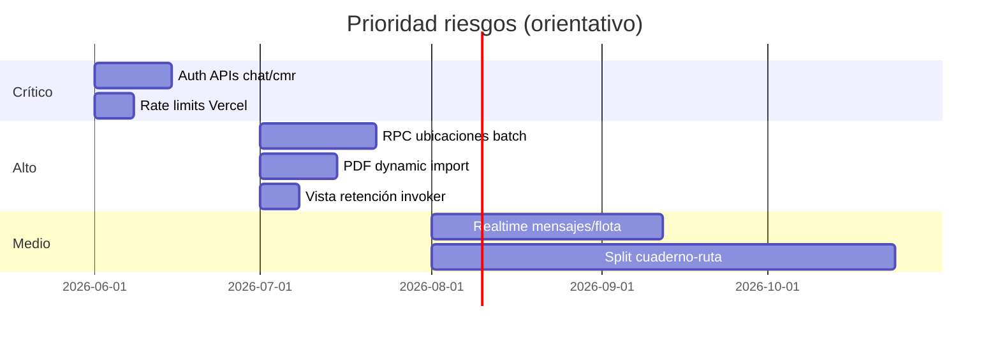

# Registro de riesgos — Cuaderno de Ruta

**Fecha:** 2026-06-05  
**Versión:** 1.0  
**Alcance:** Producto completo (PWA, Supabase REAL, Vercel prod)  
**Documentos relacionados:** [SEGURIDAD.md](./SEGURIDAD.md), [RENDIMIENTO.md](./RENDIMIENTO.md)

---

## Metodología

Cada riesgo se evalúa con:

| Campo | Escala |
|-------|--------|
| **Riesgo** | Crítico / Alto / Medio / Bajo |
| **Impacto** | Crítico / Alto / Medio / Bajo |
| **Probabilidad** | Alta / Media / Baja |
| **Prioridad** | P = Impacto × Probabilidad (C=3, A=2, M=1, B=0) |

---

## Matriz resumen (Top 25)

| ID | Riesgo | Categoría | Riesgo | Impacto | Prob. | P | Estado |
|----|--------|-----------|--------|---------|-------|---|--------|
| R-001 | APIs `/api/chat` y `/api/cmr` abiertas sin JWT | Seguridad | **Crítico** | Alto | **Alta** | **9** | Abierto |
| R-002 | Abuso coste Anthropic (chat/CMR público) | Financiero | **Crítico** | Alto | **Alta** | **9** | Abierto |
| R-003 | Monolito 18k LOC — fallos y regresiones | Técnico | **Alto** | Alto | **Alta** | **9** | Abierto |
| R-004 | `user_can_access_servicio` mal aplicada en REAL | Seguridad | **Crítico** | **Crítico** | Media | **9** | Mitigado* |
| R-005 | Polling masivo — degradación con escala | Rendimiento | Alto | Alto | **Alta** | **9** | Abierto |
| R-006 | `create_office_user` sin Bearer JWT | Seguridad | **Alto** | Alto | Media | **6** | Abierto |
| R-007 | `/api/send-docs-email` sin autenticación | Seguridad | **Alto** | Alto | Media | **6** | Abierto |
| R-008 | Superadmin por email/UID hardcodeado | Seguridad | **Alto** | **Crítico** | Baja | **6** | Abierto |
| R-009 | Bundle 2 MB — UX móvil lenta | Rendimiento | Alto | Alto | **Alta** | **9** | Abierto |
| R-010 | Login sync 5000 entries | Rendimiento | Alto | Alto | **Alta** | **9** | Abierto |
| R-011 | N+1 ubicaciones flota (1 req/conductor) | Rendimiento | Alto | Alto | **Alta** | **9** | Abierto |
| R-012 | `v_retention_metrics_summary` definer + grant | Seguridad | Alto | Alto | Media | **6** | Abierto |
| R-013 | Divergencia schema DEMO vs REAL | Operacional | Alto | Alto | Media | **6** | Parcial |
| R-014 | `conductor_lee_empresa` permisiva (DEMO) | Seguridad | Alto | Medio | Alta (demo) | **6** | Demo only |
| R-015 | Bucket `expediente_firma` sin RLS migración | Seguridad | Alto | Alto | Media | **6** | Abierto |
| R-016 | GPS conductores visible a owner flota | Privacidad | Medio | Alto | **Alta** | **6** | Aceptado** |
| R-017 | Enlaces DeCA públicos por token/UUID | Seguridad | Medio | Medio | Media | **4** | Aceptado** |
| R-018 | Deep link equipo por código corto | Seguridad | Medio | Medio | Media | **4** | Abierto |
| R-019 | `SERVICE_ROLE` en APIs Vercel | Seguridad | Alto | **Crítico** | Baja | **6** | Mitigado* |
| R-020 | Sin Realtime — datos stale en UI | Operacional | Medio | Medio | **Alta** | **6** | Abierto |
| R-021 | Funciones debug SQL en authenticated | Seguridad | Medio | Medio | Media | **4** | Abierto |
| R-022 | Chat messages poll sin limit | Rendimiento | Medio | Medio | **Alta** | **6** | Mitigado*** |
| R-023 | Reloj 1 Hz + calcNorma CPU | Rendimiento | Medio | Medio | **Alta** | **6** | Abierto |
| R-024 | PDF en cliente (memoria móvil) | Rendimiento | Medio | Alto | Media | **6** | Abierto |
| R-025 | Stripe `APP_URL` hardcoded | Operacional | Bajo | Medio | Baja | **2** | Abierto |

\* Mitigado = controles existentes pero requieren vigilancia continua.  
\*\* Aceptado = riesgo de negocio conocido.  
\*\*\* Mitigado = recibos lectura en prod; poll sigue sin limit.

---

## Detalle por categoría

### A. Seguridad y acceso

#### R-001 — APIs IA sin autenticación

| Campo | Valor |
|-------|-------|
| **Descripción** | `POST /api/chat` y `POST /api/cmr` aceptan peticiones anónimas con CORS `*`. |
| **Riesgo** | Crítico |
| **Impacto** | Alto — coste API, abuso, reputación |
| **Probabilidad** | Alta — endpoint público en internet |
| **Solución** | JWT Supabase obligatorio; rate limit por IP/uid; deshabilitar CORS `*` |
| **Esfuerzo** | Bajo |
| **Referencias** | `api/chat.js`, `api/cmr.js` |

#### R-004 — RLS servicios (primitivo central)

| Campo | Valor |
|-------|-------|
| **Descripción** | Toda la seguridad multi-tenant depende de `user_can_access_servicio()`. |
| **Riesgo** | Crítico si falla |
| **Impacto** | Crítico — fuga datos entre empresas |
| **Probabilidad** | Media — muchas redefiniciones en migraciones |
| **Solución** | Suite tests SQL; inventario REAL (`audit-supabase-inventory.sql`); congelar función canónica |
| **Esfuerzo** | Medio |

#### R-006 — Creación usuarios oficina

| Campo | Valor |
|-------|-------|
| **Descripción** | `create_office_user` valida `caller_uid` en body sin verificar JWT. |
| **Riesgo** | Alto |
| **Impacto** | Alto — creación usuarios no autorizada |
| **Probabilidad** | Media |
| **Solución** | `Authorization: Bearer` + `auth.getUser()` en servidor |
| **Esfuerzo** | Bajo |

#### R-012 — Vista retención SECURITY DEFINER

| Campo | Valor |
|-------|-------|
| **Descripción** | `v_retention_metrics_summary` agrega datos cross-tenant con privilegios owner. |
| **Riesgo** | Alto |
| **Impacto** | Alto — métricas globales expuestas vía PostgREST |
| **Probabilidad** | Media si `GRANT SELECT` a authenticated |
| **Solución** | `security_invoker` + RPC `retention_fetch_metrics_summary` con `is_retention_admin()` |
| **Esfuerzo** | Medio |

---

### B. Rendimiento y escalabilidad

#### R-005 — Arquitectura poll-only

| Campo | Valor |
|-------|-------|
| **Descripción** | Flota 120 s, ubicación 90 s, servicio 30 s, mensajes 30 s, DCDT 20 s. |
| **Riesgo** | Alto |
| **Impacto** | Alto — coste Supabase, latencia UI, batería |
| **Probabilidad** | Alta con usuarios activos |
| **Solución** | Realtime channels; pausar en background; backoff |
| **Esfuerzo** | Alto |

#### R-009 — Bundle monolítico

| Campo | Valor |
|-------|-------|
| **Descripción** | Un chunk ~2 MB incluye PDF, DCDT, empresa, tacógrafo. |
| **Riesgo** | Alto |
| **Impacto** | Alto — TTI en 4G, abandono |
| **Probabilidad** | Alta en conductores móvil |
| **Solución** | Code splitting; dynamic imports; route-based chunks |
| **Esfuerzo** | Alto |

#### R-011 — N+1 ubicaciones

| Campo | Valor |
|-------|-------|
| **Descripción** | `Promise.all(conductores.map(uid => readLatestConductorLocation))` cada 90 s. |
| **Riesgo** | Alto |
| **Impacto** | Alto — 50 conductores = 50 req/90 s por panel abierto |
| **Probabilidad** | Alta en empresas medianas |
| **Solución** | RPC única `get_fleet_locations(empresa_id)` |
| **Esfuerzo** | Medio |

---

### C. Operacional y mantenimiento

#### R-013 — DEMO ≠ REAL

| Campo | Valor |
|-------|-------|
| **Descripción** | ~15 migraciones marcadas DEMO; políticas más permisivas; funciones VOLATILE. |
| **Riesgo** | Alto |
| **Impacto** | Alto — bug solo en prod o regresión al portar demo→prod |
| **Probabilidad** | Media |
| **Solución** | `compare-supabase-inventory.mjs` en CI; checklist pre-release |
| **Esfuerzo** | Medio |
| **Referencias** | `scripts/SUPABASE-REAL-vs-DEMO.md` |

#### R-003 — Deuda monolito

| Campo | Valor |
|-------|-------|
| **Descripción** | `cuaderno-ruta.jsx` concentra UI, estado, dominio, mapas. |
| **Riesgo** | Alto |
| **Impacto** | Alto — velocidad desarrollo, bugs en cascada |
| **Probabilidad** | Alta en cada feature |
| **Solución** | Extracción incremental por dominio (ya iniciada en `features/`) |
| **Esfuerzo** | Muy alto |

---

### D. Privacidad y cumplimiento

#### R-016 — Ubicación GPS conductores

| Campo | Valor |
|-------|-------|
| **Descripción** | Owner empresa lee `ubicaciones` de conductores vinculados (`ubi_sel_empresa_flota`). |
| **Riesgo** | Medio (legal) |
| **Impacto** | Alto — RGPD, relación laboral |
| **Probabilidad** | Alta (feature usada) |
| **Solución** | Política privacidad; consentimiento; retención limitada; auditoría accesos |
| **Esfuerzo** | Legal + medio técnico |

#### R-017 — DeCA verificación pública

| Campo | Valor |
|-------|-------|
| **Descripción** | QR inspección sin login; snapshot limitado. |
| **Riesgo** | Medio |
| **Impacto** | Medio — exposición datos transporte |
| **Probabilidad** | Media (token debe filtrarse) |
| **Solución** | Token largo; solo estados validados; sin PII conductor |
| **Esfuerzo** | Bajo — ya parcialmente implementado |

---

### E. Financiero y terceros

#### R-002 — Coste APIs externas

| Campo | Valor |
|-------|-------|
| **Descripción** | Anthropic sin rate limit en endpoints públicos. |
| **Riesgo** | Crítico |
| **Impacto** | Alto — factura impredecible |
| **Probabilidad** | Alta si URL descubierta |
| **Solución** | Auth + cuotas + alertas billing Anthropic |
| **Esfuerzo** | Bajo |

#### R-025 — Stripe URL fija

| Campo | Valor |
|-------|-------|
| **Descripción** | Return URL hardcoded a `tacografo-pro.vercel.app`. |
| **Riesgo** | Bajo |
| **Impacto** | Medio en previews/staging |
| **Probabilidad** | Baja |
| **Solución** | `APP_URL` env en todos entornos |
| **Esfuerzo** | Bajo |

---

## Riesgos mitigados recientemente

| ID | Riesgo | Mitigación | Fecha |
|----|--------|------------|-------|
| R-M01 | Chat no leído en localStorage | `chat_service_read_receipts` + RLS por usuario | 2026-06 |
| R-M02 | UI conductor distinta prod/demo | `isConductorSimplifiedParadasUiEnabled()` | 2026-06 |
| R-M03 | Soltar parada sin validación | RPC `soltar_parada_conductor_guarded` | 2026-06 |
| R-M04 | Grants `anon` en tablas core | `20260518160000_revoke_anon_table_grants.sql` | 2025 |

---

## Roadmap de remediación sugerido

### Sprint inmediato (recomendado)

1. **R-001, R-002** — Auth en `/api/chat` y `/api/cmr`  
2. **R-007** — Auth en `/api/send-docs-email`  
3. **R-006** — Bearer en `create_office_user`  
4. **R-022** — Limit/proyección en `listServiceMessages`  
5. **R-012** — Fix vista retención (SQL ya diseñado)

### Sprint siguiente

6. **R-011** — RPC ubicaciones batch  
7. **R-009** — Dynamic import PDF  
8. **R-013** — Inventario automatizado REAL vs migraciones en CI

---

## Responsables sugeridos

| Área | Owner típico |
|------|--------------|
| RLS / SQL | Backend / DBA |
| APIs Vercel | Backend |
| Frontend perf | Frontend |
| Privacidad GPS | Product + Legal |
| Inventario DEMO/REAL | DevOps / Release |

---

## Control y revisión

| Actividad | Frecuencia |
|-----------|------------|
| Ejecutar `preflight-prod-sql-audit.sql` | Cada release |
| Comparar inventario REAL vs DEMO | Mensual |
| Revisar logs Vercel `/api/*` 4xx/5xx | Semanal |
| Lighthouse móvil en tacografo-pro | Por release |
| Rotación `SERVICE_ROLE_KEY` | Anual |

---

*Próxima revisión recomendada: tras cerrar R-001 a R-007 o en 90 días.*
